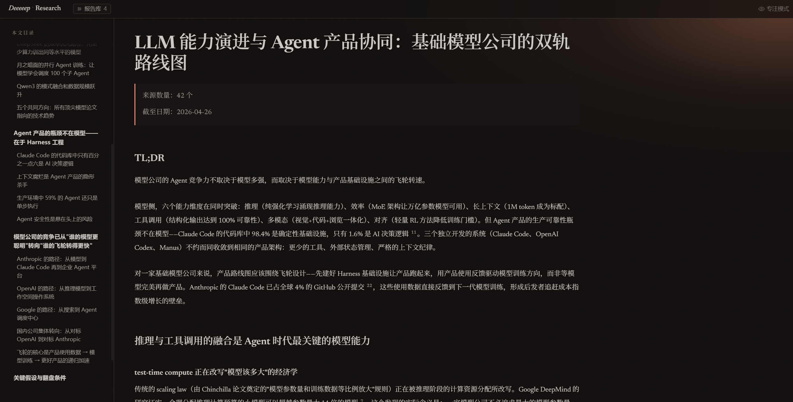

# Deep Research

端到端深度研究 Skill。四阶段流水线：需求对齐 → 多 Agent 并行数据收集 → 证据交叉验证 → 报告生成，产出带完整引用的结构化研究报告，自动渲染到内置的阅读器页面。

适用于 [Claude Code](https://docs.anthropic.com/en/docs/claude-code) 及任何支持自定义 System Prompt + 文件读写 + Shell 执行 + 子 Agent 调度的 LLM 框架。

[English](README.en.md)



---

## 特性

- **四阶段硬约束流水线** — 需求对齐 → 数据收集 → 证据分析 → 报告生成，不允许跳过或合并阶段
- **多 Agent 并行收集** — 按领域分派专业子 Agent（学术 / 工程 / 商业 × 中文 / 英文），各自带领域专属的搜索策略和权威判断标准
- **五层来源分级** — T1 一手权威 / T2 强二手 / T3 专业媒体 / T4 一般媒体 / T5 用户生成内容，同一来源在不同问题上可能处于不同层级
- **证据交叉验证** — 识别独立来源 vs 转述链（10 篇报道同一项研究 ≠ 10 重证据），主动搜索反面证据
- **内置报告阅读器** — 深色编辑风格的 Web 阅读器，带目录联动、引用弹窗、来源分级着色、专注模式、报告库管理
- **YMYL 安全协议** — 健康、财务、法律类话题自动触发更严格的证据门槛和表述约束
- **引用完整性保障** — 每条引用必须来自本次搜索实际获取的结果，禁止凭记忆编造 URL / DOI / 论文标题

---

## 报告阅读器

研究报告生成后自动写入 `reports/` 目录，通过内置的 Web 阅读器渲染和浏览。

**阅读体验：**
- 深色编辑风格排版，Newsreader + Noto Serif SC 字体
- 左侧目录实时跟随滚动位置高亮当前章节
- 角标 hover 弹出引用来源卡片，显示标题、摘录、URL、权威层级（T1–T5 分色标注）
- 专注模式：隐藏侧边栏，当前段落高亮、其余段落淡化
- 深浅主题切换，跟随系统偏好

**报告管理：**
- 左上角报告库抽屉列出所有报告，支持标题搜索
- 显示修改时间和字数统计
- 新增报告刷新浏览器即可出现，无需重启

### 启动阅读器

```bash
# Windows
viewer/start.bat

# macOS / Linux
python3 viewer/serve.py
```

浏览器访问 `http://127.0.0.1:8765/viewer/`。Skill 在报告生成完成后会自动启动服务并输出查看链接。

---

## 工作流程

```
Phase 1 需求对齐 ── 与用户确认研究目标、子问题拆解、结论服务什么决策
│
Phase 2 数据收集 ── 按领域派遣子 Agent 并行搜索，每组带专属搜索策略
│
Phase 3 证据分析 ── 交叉验证、置信度评估、矛盾识别
│
Phase 4 报告生成 ── 结构化报告 + sources.json → 自动渲染到阅读器
```

### Phase 1：需求对齐

与用户确认研究方向。用户说"帮我调研 X"时，背后通常有一个具体的决策要做——选型、判断风险、说服上级。只理解"X"而不理解决策，搜出来的信息角度会偏。用复述代替追问，用最少的问题搞清最关键的事。

### Phase 2：数据收集

按领域分组并行搜索。六个专业子 Agent：

| 子 Agent | 覆盖范围 |
|----------|---------|
| 英文学术 | 科学证据、临床研究、学术综述、理论分析 |
| 中文学术 | 中文期刊、中国临床试验、中文学术生态 |
| 英文工程 | 技术文档、开源项目、RFC 标准、技术社区 |
| 中文工程 | 国标/行标、国内技术博客、中文技术社区 |
| 英文商业 | SEC 文件、行业报告、财经媒体、事实核查 |
| 中文商业 | A 股/港股披露、央媒政策、中文财经媒体 |

每个子 Agent 读取自己的领域方法论（`references/agents/{domain}.md`），按需参考来源权威性指南和搜索策略文档。

### Phase 3：证据分析

把原始证据整理成可靠结论：识别哪些来源真正独立、哪些互相矛盾、每个结论的置信度多高。证据不足时，"证据不足"本身就是结论——不用流畅的语言掩盖空白。

### Phase 4：报告生成

按格式契约生成报告和 `sources.json`，验证正文角标与来源条目的一致性，自动启动阅读器并交付查看链接。

---

## 失败模式防御

### 高危

- **证据不足时给确定结论** — YMYL 话题中证据确定性为"低"时，不给行动建议
- **把转述当独立来源** — 必须追溯原始来源
- **漏掉利益冲突** — 药企资助的研究、厂商白皮书不是独立证据
- **编造引用** — 每条 URL / DOI 必须来自本次搜索，搜不到标注"未能找到原始来源"

### 中危

- **只搜一种语言** — 中文问题只搜中文或只搜英文都会遗漏
- **结论先行、证据后补** — 每个结论主动搜反面证据
- **用"有待进一步研究"敷衍** — 不说清缺什么、下一步查什么等于没说

---

## 项目结构

```
deeeeep-research/
├── SKILL.md                           # 核心技能定义
├── references/
│   ├── phase1-needs-alignment.md      # 需求对齐方法论
│   ├── phase2-data-collection.md      # 数据收集调度逻辑
│   ├── phase3-evidence-analysis.md    # 证据分析方法论
│   ├── phase4-report-generation.md    # 报告生成格式契约
│   ├── source-authority.md            # 五层来源权威性判断指南
│   ├── search-strategy.md             # 搜索策略
│   ├── ymyl-protocol.md               # YMYL 安全协议
│   └── agents/
│       ├── en-academic.md             # 英文学术子 Agent
│       ├── zh-academic.md             # 中文学术子 Agent
│       ├── en-engineering.md          # 英文工程子 Agent
│       ├── zh-engineering.md          # 中文工程子 Agent
│       ├── en-commercial.md           # 英文商业子 Agent
│       └── zh-commercial.md           # 中文商业子 Agent
├── viewer/                            # 内置报告阅读器
│   ├── index.html                     # 阅读器页面
│   ├── app.js                         # 渲染引擎（Markdown → 交互式页面）
│   ├── styles.css                     # 编辑风格排版
│   ├── serve.py                       # 本地 HTTP 服务 + manifest 动态生成
│   ├── start.bat                      # Windows 启动脚本
│   ├── validate_report.py             # 报告格式验证工具
│   └── lib/
│       ├── markdown-it.min.js         # Markdown 渲染
│       └── markdown-it-anchor.umd.js  # 标题锚点生成
└── reports/                           # 研究报告存放目录
```

---

## 安装

```bash
git clone https://github.com/koukekoukej-glitch/deeeeep-research.git ~/.claude/skills/deeeeep-research
```

Claude Code 自动识别触发条件。也可将 `SKILL.md` 作为 System Prompt 加载到其他框架。

### 触发

自然语言触发：

```
> 帮我调研 X
> 比较 X vs Y
> X 的最新进展
> X 是否安全/有效
```

---

## 设计原则

1. **阶段不可跳过** — 四阶段顺序执行，每阶段有明确的完成条件和门控
2. **领域专业化** — 子 Agent 按领域分工，比通用 Agent 搜所有地方效果更好
3. **证据优先于结论** — 先收集再判断，主动搜反面证据，不做结论先行
4. **不确定性归因于证据** — 说"证据对 X 的支撑不够"，不说"我不确定"
5. **可追溯** — 每条结论可追溯到具体来源，用户能判断该信多少

---

## License

[MIT](LICENSE)
